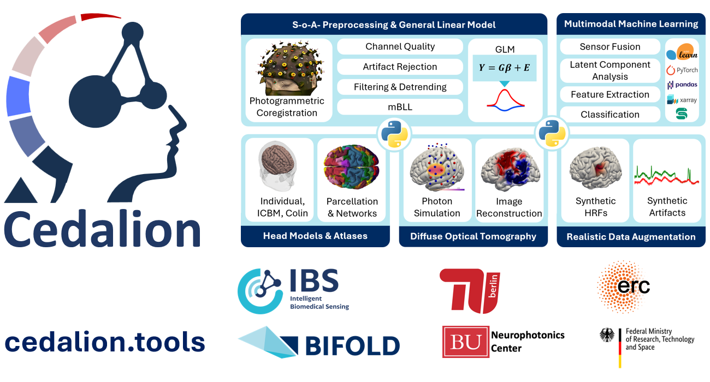

# Cedalion - fNIRS analysis toolbox

A python-based framework for the data-driven analysis of multimodal fNIRS and DOT in naturalistic environments. Developed by the [Intelligent Biomedical Sensing (IBS) Lab](https://ibs-lab.com/) with and for the community.

<p align="center">
    
</p>


## Documentation

The [documentation](https://doc.ibs.tu-berlin.de/cedalion/doc/dev) contains
[installation instructions](https://doc.ibs.tu-berlin.de/cedalion/doc/dev/getting_started/installation.html), an [API reference](https://doc.ibs.tu-berlin.de/cedalion/doc/dev/api/modules.html) as
well as many [example notebooks](https://doc.ibs.tu-berlin.de/cedalion/doc/dev/examples.html) that illustrate the functionality of the toolbox.


## Installation

Please refer to the [installation instructions](https://doc.ibs.tu-berlin.de/cedalion/doc/dev/getting_started/installation.html) in the documentation for installing Cedalion
on you computer.

To test the [example notebooks](https://doc.ibs.tu-berlin.de/cedalion/doc/dev/examples.html) without installing Cedalion locally, you can also [run the notebooks on Google Colab](https://doc.ibs.tu-berlin.de/cedalion/doc/dev/getting_started/colab_setup.html).

## Versions
The `main` branch acts as a release branch, i.e. the latest commit there is the most 
current release. Development happens in the `dev` branch. Please refer to the [CHANGELOG](https://doc.ibs.tu-berlin.de/cedalion/doc/dev/CHANGELOG.html) for a release 
history and current differences between the `dev` and `main` branches.


## Forum

For discussions and help please visit the [Cedalion forum on openfnirs.org](https://openfnirs.org/community/cedalion/)


## How to cite Cedalion

If this toolbox was used in your published work, we kindly ask you to cite the Cedalion Tutorial Paper:

> Eike Middell, Laura B. Carlton, Shakiba Moradi, et al. "Cedalion tutorial: a Python-based framework for comprehensive analysis of multimodal fNIRS and DOT from the lab to the everyday world," Neurophotonics 13(S3), S32602 (13 Aug 2026). [https://doi.org/10.1117/1.NPh.13.S3.S32602](https://doi.org/10.1117/1.NPh.13.S3.S32602)

**BibTex**

```bibtex
@article{cedalion:2026,
author = {Eike Middell and Laura B. Carlton and Shakiba Moradi and Tom{\'a}s Codina and Thomas Fischer and Josef Cutler and Shannon Kelley and Jacqueline Behrendt and Theekshana Dissanayake and Nils Harmening and Meryem A. Y{\"u}cel and David A. Boas and Alexander von L{\"u}hmann},
title = {{Cedalion tutorial: a Python-based framework for comprehensive analysis of multimodal fNIRS and DOT from the lab to the everyday world}},
volume = {13},
journal = {Neurophotonics},
number = {S3},
publisher = {SPIE},
pages = {S32602},
year = {2026},
doi = {10.1117/1.NPh.13.S3.S32602},
URL = {https://doi.org/10.1117/1.NPh.13.S3.S32602}
}
```

Furthermore, for methods implemented in Cedalion, check the [bibliography](https://doc.ibs.tu-berlin.de/cedalion/doc/dev/references.html) as well as [the toolbox's functionality to cite
methods used](https://doc.ibs.tu-berlin.de/cedalion/doc/dev/community/index.html#scientific-credit).


## License

Cedalion is licensed under the MIT license.