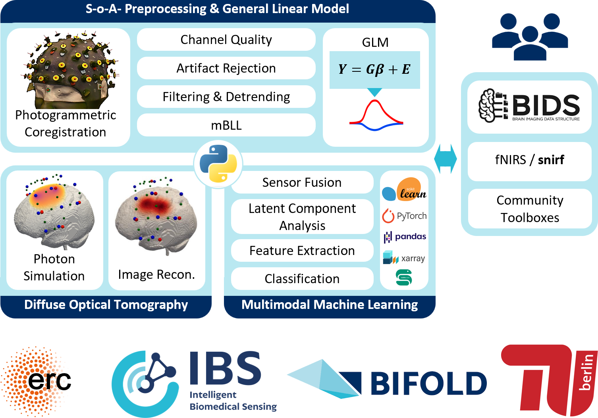

# Cedalion - fNIRS analysis toolbox

A python-based framework for the data-driven analysis of multimodal fNIRS and DOT in naturalistic environments. Developed by the [Intelligent Biomedical Sensing (IBS) Lab](https://ibs-lab.com/) with and for the community.

    

## Documentation

The [documentation](https://doc.ibs.tu-berlin.de/cedalion/doc/dev) contains
[installation instructions](https://doc.ibs.tu-berlin.de/cedalion/doc/dev/getting_started/installation.html), an [API reference](https://doc.ibs.tu-berlin.de/cedalion/doc/dev/api/modules.html) as
well as many [example notebooks](https://doc.ibs.tu-berlin.de/cedalion/doc/dev/examples.html) that illustrate the functionality of the toolbox.

## Installation

Please refer to the [installation instructions](https://doc.ibs.tu-berlin.de/cedalion/doc/dev/getting_started/installation.html) in the documentation for installing Cedalion
on you computer.

To test the [example notebooks](https://doc.ibs.tu-berlin.de/cedalion/doc/dev/examples.html) without installing Cedalion locally, you can also [run the notebooks on Google Colab](https://doc.ibs.tu-berlin.de/cedalion/doc/dev/getting_started/colab_setup.html).

## Versions
The `main` branch acts as a relase branch, i.e. the latest commit there is the most 
current release. Development happens in the `dev` branch. Please refer to the [CHANGELOG](https://doc.ibs.tu-berlin.de/cedalion/doc/dev/CHANGELOG.html) for a release 
history and current differences between the `dev` and `main` branches.

## Forum

For discussions and help please visit the [Cedalion forum on openfnirs.org](https://openfnirs.org/community/cedalion/)

## How to cite Cedalion
A paper for the toolbox is currently in the making. If you use this toolbox for a publication in the meantime, please cite us using GitHub's  "Cite this repository" feature in the "About" section. If you want to contact us or learn more about the IBS-Lab please go to https://www.ibs-lab.com/

## License

Cedalion is licensed under the MIT license.