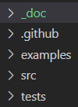

# A brief beginners guide for contributing functionality

The aim of this document is to help you get started with contributing your own code/functionality to cedalion. Since the toolbox is in its early stage the documentation is only beginning to be set up and information will be updated continuously.

## General Rules
When contributing code, try to incorporate it into the existing file and folder structure, which also represents cedalions package and subpackages. Python files (=modules) contain functions of the same category and folders (subpackages) contain python files of the same family. Examples:
- "SplineSG" and "tPCA" functions should be part of the same python file (module) "artefactcorr", which contains all functions of the "artefact correction" category
- "artefactcorr.py" and "quality.py" belong into the folder (subpackage) "sigproc", which contains all categories(modules) that belong to the"signal processing" family 

Only if your new code does semantically or functionally not belong to any existing module or subpackage should you create new ones. But please do so in that case. To commit new code, please create a pull-request to  @emidell on github. The code will be merged after a code review.

## File and folder structure
When you write code, you will have to integrate it into the existing structure. The cedalion directory is structured into 4 sections: 


1) **doc**: documentation.
2) **examples**: a directory with jupyter notebooks that exemplify an assembled pipeline or functionality. Should be executable in a standalone fashion and annotated to explain the code to a naive user. If you add significantly complex new functionality, you generate an example notebook here. For contributing new functions, you might want to start with a jupyter notebook, from which you then migrate matured code into functions in the source folder.
3) **src**: the source folder that is the codebase of the toolbox. More details below.
4) **tests**: unit tests for cedalion code, are run upon commit on github to check code consistency.

The following gives a brief overview of the **src** directory structure:


Widely used general functionality is part of the files on the top level (e.g. nirs.py ).

| **directory** | **explanation** |
| ----------- | ----------- |
| **data** | Look up tables and other small datasets often required for ecexuting functions. |
| **dataclasses** | Dataclass definitions that are used in cedalion. Example: in xrschemas.py you can find that we work with xarray objects (see more detail in the next section). For time series data these have to have at least two dimensions: "time" and "channel".  |
| **geometry** | Functions for geometric manipulations, e.g. for optode registration, building landmarks on a 3D head, head segmentation, etc. |
| **imagereco** | Functions for DOT image reconstruction |
| **io** | Functions for reading and writing data to and from cedalion. This includes for instance fnirs data in snirf format, probe geometries or reading anatomies (e.g. segmentation masks). |
| **models** | Functions for data modelling, for instance the General Linear Model (GLM).|
| **sigdecomp** | Functions for signal decomposition methods that are not part of a standard python distribution, e.g. advanced ICA methods.|
| **sigproc** | Functions for time series signal processing, i.e. filtering, artefact rejection, signal quality assessment.|
| **sim** | Functionality for simulation and data augmentation, for instance adding synthetic HRFs or creating toydata.|


## Data Classes and X-Arrays 
Cedalion is using XArrays as main data structures for processing. There are currently two jupyter notebooks that explain these data structures:

[Using xarray-based data structures for calculating the Beer-Lambert transformation](https://github.com/ibs-lab/cedalion/blob/alex_working/examples/pruning_and_motion_artifacts.ipynb)

[An example finger tapping analysis](https://github.com/ibs-lab/cedalion/blob/main/examples/new_conference_example2.ipynb)

## Example for contributing new functionality to Cedalion
In this example we will incorporate two new functions into the toolbox: A function that identifies motion artifacts in fNIRS data and a function to prune bad channels. Both functions are replicating the Homer3 functions "hmR_MotionArtifact" and "hmR_PruneChannels". 
The corresponding jupyter notebook example to showcase the code in this file is the [Pruning and Motion Artefacts Notebook Example](https://github.com/ibs-lab/cedalion/blob/alex_working/examples/pruning_and_motion_artifacts.ipynb). **Please check it out to get an idea of how to get snirf data into a typical xarray structure that the functions are expecing.**

### Where do these functions belong?
The function to prune channels belongs to /siproc/quality.py and will simply be called "prune". It will then be available with 

`import cedalion.sigproc.quality` and calling `quality.prune()`. The `quality.prune()`function will use an SNR threshold, amongst others, to classify channels as bad channels. For this we create a small helper function in the same module, `quality.snr()`, as it might come in handy elswhere too.

The function to identify motion artifacts belongs to a new module in the sigproc subpackage, since at the time of this example sigproc only has a module "frequency" and "quality". We will call this module "artifact" and the function "id_motion". It will then be available with 

`import cedalion.sigproc.artifact` and calling `artifact.id_motion()`.

### Adding a new function
The barebone structure of a function in cedalion is the following:

```
import cedalion.dataclasses as cdc
import cedalion.typing as cdt
from cedalion import Quantity, units


@cdc.validate_schemas
def function_name(inputVar1: cdt.NDTimeSeries, inputVar2: Quantity):
    
    """What does this function do?.

    [1] Authors et al., "title", Journal vol., year, doi:
    """

    #
    # YOUR CODE
    #

    return something

```

This generates a new function *function_name* with two input arguments *inputVar1* and *inputVar2* that returns what it did as *something*.
The input arguments should have expected data types assigned to them. Here, *inputVar1* is expected to be of the data type "NDTimeSeriesSchema", which is an xarray that contains at least two dimensions "channel" and "time". *inputVar2* is expected to be of the data type *Quantity* ==[TBD? @emiddell]==.   
The function is wrapped by putting `@cdc.validate_schemas`in front, which will check these data types and assert an error at runtime, if the inputs do not match the expected type.

The following examples are implemented in the [quality.py module](https://github.com/ibs-lab/cedalion/blob/alex_working/src/cedalion/sigproc/quality.py)
Now we can create a small helper function that calculates the SNR of fNIRS channels that will be used in the main `quality.prune()` routine. Using restricting the argument to an xarray time series input type allows us to calculate the SNR in a single line.

```
@cdc.validate_schemas
def snr(amplitudes: cdt.NDTimeSeries):
    """Calculates channel SNR of each channel and wavelength as the ratio betwean mean and std 
    of the amplitude signal    
    """
    snr = amplitudes.mean("time") / amplitudes.std("time")

    return snr
```

The actual `quality.prune()` method can be built around this helper function and includes some other thresholding parameters. The pruning function is expected to provide a list of either active (good) or pruned (bad) channels. In the current approach we use "MeasList", which is a subset of the xarray "channel" coordinates: Every channel that gets pruned is simply removed from that list. The output data structure of the function is therefore identical to the input data structure, with simply an added/changed "MeasList" that can be used to easily select or reject (un)pruned channels. 

```
#@cdc.validate_schemas
def prune(data: cdt.NDTimeSeries, SNRThresh: Quantity, dRange: Quantity, SDrange: Quantity):
    
    # create list of active channels if it does not exist yet
    if not hasattr(data, "MeasList"):
        # add measurement list to dat xarray object. it countains the full list of channels
        data['MeasList'] = list(data.coords['channel'].values)
  
    # for all active channels in the MeasList check if they meet the conditions or drop them from the list

    ## find channels with bad snr
    # calculate SNR of channel amplitudes and find channels with SNR below threshold. Then remove them from the MeasList
    dat_snr = snr(data.amp) 
    drop_list = dat_snr.where(dat_snr < SNRThresh).dropna(dim="channel").channel.values   
    data = data.drop_sel(MeasList=drop_list)
    
    ## Calculate channel distances for all channels in the measurement list from the geo3D coordinates
    ## Remove channels outside of dRange:TBD + update quality.prune
    ## Remove channels outside of SDrange:TBD + update quality.prune


    return data
```
