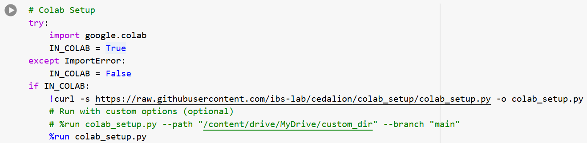
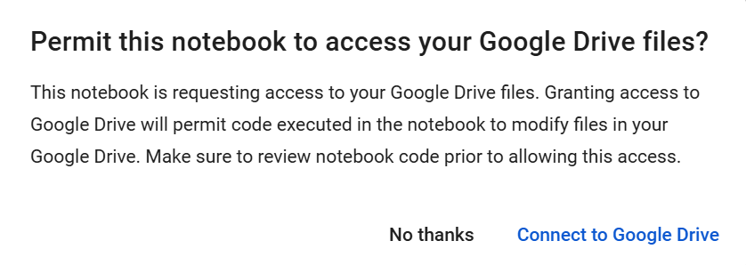

## Running Notebooks in Google Colab

If you would like to test cedalion before going through the installation process on your local machine, you can run the example notebooks through Google Colab. This requires a Google account with approximately 50MB available storage space. To open a notebook using Google Colab, follow the steps below. The first time you open a notebook in Colab, setup can take 10-20 minutes. For subsequent notebooks the steps remain the same, but setup should be much faster.

1. Click the link at the top of an example notebook to open it in Google Colab: 
2. Run the first cell to install the required dependencies in a virtual environment on your Google Drive.
    
3. Follow the prompts to sign into your Google Drive account. 
    
4. At the end of the setup process you may also be prompted to restart the runtime (Ctrl-M .) and run the cell a second time. 
5. Proceed with the rest of the example notebook.