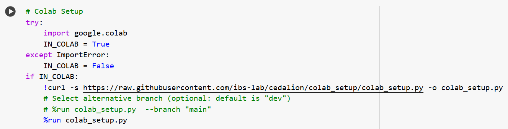
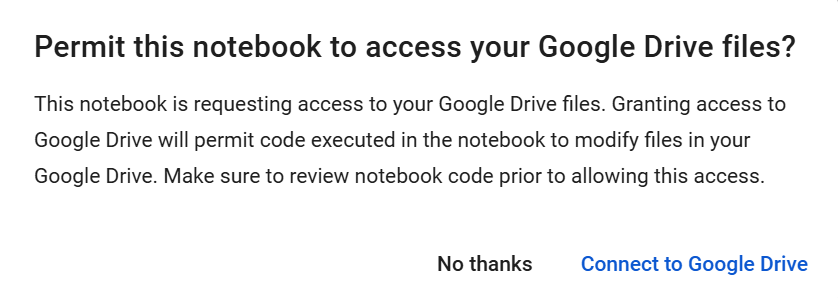
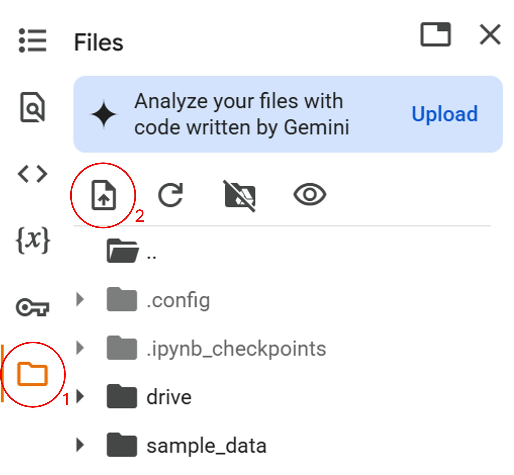

# Running Notebooks in Google Colab

If you would like to test cedalion before going through the installation process on your local machine, you can run the example notebooks through Google Colab. Note however, that some cedalion features, such as interactive plotting and visualizations, are currently not working in colab. To use these features, you will need to install cedalion on your local machine.

## Setup
To run a notebook using Google Colab, follow the steps below. Setup should take less than 5 minutes total.

1. Click the link at the top right of an example notebook to open it in Google Colab: 

   []()
2. Run the first cell to install the required dependencies.
    - Optional: set options to specify the branch of cedalion to use (--branch).
    
3. Follow the prompts to sign into your Google Drive account. 
    
4. After the cell runs once you will be prompted to restart the runtime (Ctrl-M .) and run the cell a second time. 
5. Proceed with the rest of the example notebook.


## Using your own data

You have two options to use your own data in a colab notebook.

### 1. Upload data directly to the instance

1. Click the file icon in the left sidebar.
2. Click the upload icon (page with arrow).
    
3. Choose the folder/file to upload.
4. Files can now be accessed in the notebook, for example:
   ```python
   import cedalion.io
   rec = cedalion.io.read_snirf("uploaded_file.snirf) 
   ```

5. When the instance is destroyed, uploaded and created files are deleted.


### 2. Use Google Drive
During the execution of the first notebook cell, a connection was created between
your Google Drive and the instance running the notebook. The drive is mounted
under `/content/drive`.

1. Copy files to you Google Drive.
2. Files can now be accessed in the notebook, for example:
   ```python
   import cedalion.io
   rec = cedalion.io.read_snirf("/content/drive/path/in/drive/uploaded_file.snirf) 
   ```
3. Results saved to Google Drive persist when the instance is destroyed.