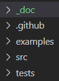
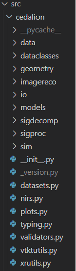

# Getting started with contributing code to Cedalion

This document provides a brief getting started guide for users who would like to contribute code/functionality to Cedalion. Our aim is to make the toolbox useful for both naive users, who would like to apply abstract workflows without caring too much about the details of implementation, as well as for developers that would like to build their own methods and contribute new functionality. At the current time, the toolbox is its early stage and both documentation and abstraction levels are continuously growing. For now, if you contribute code, adopt a **bottom up** development approach: write simple functions with simple input arguments and data structures, that can and will later on be wrapped by functions that add abstraction and usability. Develop and test in jupyter notebooks (which you can then contribute as examples for how to use functionality) and migrate code to Cedalion's /src/ when it is tested.

## Where to get started?
It is smart to make yourself aware of five resources and concepts that build the foundations for Cedalion:
1) **Cedalion's documentation page**: For the moment the documentation can be found {{ '[here]({})'.format(docs_url) }}.
2) **Example Notebooks**: Cedalion provides jupiter notebooks for example pipelines and to display how to apply its functionality. Here you can start to learn from examples by running, adapting and changing code until you feel more familiar. The notebooks are under /examples/ or [here](https://github.com/ibs-lab/cedalion/tree/alex_working/examples)
3) **Xarrays** are a package that makes work with labelled mult-dimensional arrays very simple. If you develop code for Cedalion, you will youse Xarrays. To get started, make yourself acquainted with one of two key data types: *xarray.DataArray* and *xarray.DataSet*. Most functions that you write should expect an xarray DataArray as main input for the data that you want to process, alongside arguments that pass variables for additional info. You can find the official [Xarray documentation here](https://docs.xarray.dev/en/stable/).
4) **Units**: One of the charms of Xarrays that Cedalion is taking advantage of is that functions can implicitly consider units and thus avoid typical errors from (missing) unit conversion. For example, if you work with coordinates for fNIRS optodes or landmarks, as long as they have a proper unit like "m", "cm", "mm" assigned, you do not have to explicitly take care of conversions anymore. To make use of this feature, Cedalion's functions should expect input arguments that are "Quantities" with "units" wherever possible. To assign a unit to your variable, simply import `from cedalion import Quantity, units` and multiply your variable with the right unit. For instance: `sd_distance = 3*units.cm`. Cedalion's units are based on the **pint** package, which is [documented here](https://pint.readthedocs.io/en/stable/index.html).
5) **Data Containers and Data Structures**: The main objects to pass along your functions and processing pipelines. We are currently working on defining and documenting these. In the meantime, please work with Xarray DataArrays and variables with units as in and outputs for your functions, and be aware that the main format for fNIRS/DOT data that we read and write is the [SNIRF format](https://github.com/fNIRS/snirf). To easily get started, you can:
    1. Check out the example notebook on [Using xarray-based data structures for calculating the Beer-Lambert transformation](https://github.com/ibs-lab/cedalion/blob/main/examples/pruning_and_motion_artifacts.ipynb)
    2. Check out the example notebook on [An example finger tapping analysis](https://github.com/ibs-lab/cedalion/blob/main/examples/new_conference_example2.ipynb)
    3. Use the following code snippet to load snirf data into Xarray DataArrays (amp, geo, od, conc, ml) and combine them into an Xarray DataSet.
```# get example finger tapping dataset
import cedalion
import cedalion.nirs
import cedalion.datasets as datasets
import xarray as xr

snirf_element = datasets.get_fingertapping()
amp = snirf_element[0].data[0]
geo = snirf_element[0].geo3d
od = cedalion.nirs.int2od(amp)
dpf = xr.DataArray([6, 6], dims="wavelength", coords={"wavelength" : amp.wavelength})
conc = cedalion.nirs.beer_lambert(amp, geo, dpf)
meas_list = snirf_element[0].measurement_lists[0]

data = xr.Dataset(
    data_vars = {
        "amp" : amp,
        "od"  : od,
        "conc": conc
        "geo3d": geo
        "ml": meas_list
    })
```

## General Rules and Overview
### Style Guide for Python Code
We follow the PEP 8 Style that is documented [here](https://peps.python.org/pep-0008/) - please try to follow it too. If you work with VS Code, you can use extensions to make your life easier:
- [Black Formatter](https://marketplace.visualstudio.com/items?itemName=ms-python.black-formatter) that supports you in formatting your code
- [Ruff](https://marketplace.visualstudio.com/items?itemName=charliermarsh.ruff) is a fast Python linter that we recommend

Some relevant conventions in a nutshell:
- **Function Naming Rule*: lowercase with words separated by underscores as necessary to improve readability. Example: `def example_function()`. Avoid `ExampleFunction()` or `exampleFunction()`
- **Variable Naming Rule: Variable names follow the same convention as function names. Example: `my_variable = 1`. Avoid `MyVariable` and `myVariable`
- **Constants Naming Rule*: Constants are usually defined on a module level and written in all capital letters with underscores separating words. Examples: `include MAX_OVERFLOW`

### Style Guide for docstrings

Please use [documentation strings](https://docs.python.org/3/tutorial/controlflow.html#documentation-strings) 
to document modules, classes and functions. There exist several different conventions on 
how to dormat these docstrings. We will follow the Google style as described in the
[Google Python Style Guide](https://google.github.io/styleguide/pyguide.html#38-comments-and-docstrings).

**Example 1:**
```
    def func(arg1 : int, arg2 : str) -> bool:
        """One sentence description of function.

        Some more details on what the function does.

        Args:
            arg1: Description of arg1
            arg2: Description of arg2

        Returns:
            Description of return value
        """
        return True
```

**Example 2:**
```
    def func(
        arg1 : cdt.NDTimeSeries, 
        arg2 : cdt.NDTimeSeries, 
        arg3 : Quantity
    ) -> cdt.NDTimeSeries:
        """Implements algorithm XY based on :cite:t:`BIBTEXLABEL`.

        Some more details on what the function does.
        
        Args:
            arg1 (:class:`NDTimeSeries`, (channel, wavelength, time)): Description of 
                first argument. For NDTimeSeries we can specify expected dimensions
                like this.
            arg2 (:class:`NDTimeSeries`, (time, *)): Some algorithms work only along
                a given dimension (e.g. frequency filtering) and are agnostic to any
                other dimensions in the array. This should be documentated like this.
            arg3 (:class:`Quantity`, [time]): Parameters with physical units (e.g.
                lengths or time intervals) should be passed as pint.Quantities. The
                expected dimensionality should be documented like this.

        Returns:
            Description of return value. 
        """
        return True
```

Please add references to the literature if you are implementing a published algorithm.
There is a global bibtex file under `docs/references.bib` to which reference entries
should be added with a unique bibtex label. Refer to a reference entry with:
```
    :cite:t:`BIBTEXLABEL`
```
Further options are documented in the 
[sphinxcontrib-bibtex documentation](https://sphinxcontrib-bibtex.readthedocs.io/en/latest/quickstart.html#minimal-example).

All references will be listed under [References](../../references.rst).

Additional [docstring sections](https://sphinxcontrib-napoleon.readthedocs.io/en/latest/index.html#docstring-sections)
may be added, like for example: References, Notes, etc.


### Where to add my code?

When contributing code to Cedalion (=package), try to incorporate it into the existing file and folder structure, which also defines Cedalions package and subpackages. Python files (=modules) contain functions of the same category; folders (subpackages) contain python files of the same family. Examples:
- Two artefact correction methods "SplineSG" and "tPCA" functions should be part of the same python file (module) "artifact.py", which contains all functions of the category "artefact correction"
- "artifact.py" and "quality.py" belong into the folder (subpackage) "sigproc", which contains all categories(modules) that belong to the"signal processing" family

Only if your new code does semantically or functionally not belong to any existing module or subpackage should you create new ones. If you think you need to create a new one, please check back with us first. To commit new code, please create a pull-request to  @emidell or @avolu github. The code will be merged after a code review.


## File and folder structure
The Cedalion parent directory is structured into 4 sections:


1) **doc**: documentation.
2) **examples**: a directory with jupyter notebooks that exemplify an assembled pipeline or functionality. Should be executable in a standalone fashion and annotated to explain the code to a naive user. If you add significantly complex new functionality, you generate an example notebook here. For contributing new functions, you might want to start with a jupyter notebook, from which you then migrate matured code into functions in the source folder.
3) **src**: the source folder that is the codebase of the toolbox. More details below.
4) **tests**: unit tests for Cedalion code, are run upon commit on github to check code consistency.

The following gives a brief overview of the **src** directory structure:



Widely used general functionality is part of the files on the top level (e.g. nirs.py ).

| **directory** | **explanation** |
| ----------- | ----------- |
| **data** | Look up tables and other small datasets often required for ecexuting functions. |
| **dataclasses** | Dataclass definitions that are used in Cedalion. Example: in xrschemas.py you can find that we work with xarray objects (see more detail in the next section). For time series data these have to have at least two dimensions: "time" and "channel".  |
| **geometry** | Functions for geometric manipulations, e.g. for optode registration, building landmarks on a 3D head, head segmentation, etc. |
| **imagereco** | Functions for DOT image reconstruction |
| **io** | Functions for reading and writing data to and from Cedalion. This includes for instance fnirs data in snirf format, probe geometries or reading anatomies (e.g. segmentation masks). |
| **models** | Functions for data modelling, for instance the General Linear Model (GLM).|
| **sigdecomp** | Functions for signal decomposition methods that are not part of a standard python distribution, e.g. advanced ICA methods.|
| **sigproc** | Functions for time series signal processing, i.e. filtering, artefact rejection, signal quality assessment.|
| **sim** | Functionality for simulation and data augmentation, for instance adding synthetic HRFs or creating toydata.|


## Example for contributing new functionality to Cedalion
In this example we will add a few simple functions to the toolbox: Some helper functions that use different quality thresholds to differentiate good from bad fNIRS/DOT channels. A function that combines these helper functions to  prune bad channels in a dataset. These are replicating approaches from the Homer3 "hmR_PruneChannels" function.

The corresponding jupyter notebook example to showcase the resulging code is the following --> **[Pruning and Motion Artefacts Notebook Example](https://github.com/ibs-lab/cedalion/blob/main/examples/pruning_and_motion_artifacts.ipynb)**. <--

### What functions and where do they belong?
We will create three helper functions: `snr_range()`, `sd_range()` and `amp_range()` that use the SNR, the source-detector distance, and the signal amplitudes to assess whether they are within a desired (user-specified) range. We will then combine them in a `prune()` function. After browsing the */src/* directory we realize that all these functions should go to */siproc/quality.py* as they are dealing with assessing signal quality. To use these functions later on in our pipelines, we can
`import cedalion.sigproc.quality as quality` and then use `quality.snr_range` to assess SNR, or `quality.prune` which will make use of the `snr_range function`, amongst others, to prune channels.

Because we develop **bottom up**, we assume that all these functions just have xarray DataArrays as inputs, and variables that have quantities with units wherever possible.

### Adding a new function
The barebone structure of a function in Cedalion is the following:

```
import cedalion.dataclasses as cdc
import cedalion.typing as cdt
from cedalion import Quantity, units


@cdc.validate_schemas
def function_name(inputVar1: cdt.NDTimeSeries, inputVar2: Quantity):
    """What this function does.

    Args:
        inputVar1: ...
        inputVar2: ...

    Returns:
        description of the return value
    """

    #
    # YOUR CODE
    #

    return something

```

This generates a new function *function_name* with two input arguments *inputVar1* and *inputVar2* that returns what it did as *something*.
The input arguments should have expected data types assigned to them. Here, *inputVar1* is expected to be of the data type "NDTimeSeriesSchema", which is an xarray that contains at least two dimensions "channel" and "time". *inputVar2* is any input variable, that ideally (if applicable) should have a unit assigned to it.
The function is wrapped by putting `@cdc.validate_schemas`in front, which will check these data types and assert an error at runtime, if the inputs do not match the expected type.

The following examples are implemented in the [quality.py module](https://github.com/ibs-lab/cedalion/blob/main/src/cedalion/sigproc/quality.py)

### The helper functions

```{admonition} Update needed
:class: attention

The code examples are not up to date. Please refer to the 
[current source code](https://github.com/ibs-lab/cedalion/blob/main/src/cedalion/sigproc/quality.py)
```

Now we can create the small helper functions that calculate and check the SNR, Source-Detector Distances and Amplitudes of fNIRS channels. Using the coordinates and units from Xarrays these are effectively implemented:

`def snr_range():`

```
@cdc.validate_schemas
def snr_range(amplitudes: cdt.NDTimeSeries, snr_thresh: Quantity):
    """Calculates channel SNR of each channel and wavelength.

    INPUTS:
    amplitues:  NDTimeSeries, input fNIRS data xarray with time and channel dimensions.
    snr_thresh:  Quantity, SNR threshold (unitless).
                If meaArgs:
        inputVar1:n(d)/std(d) < SNRthresh then it is excluded as an active channel
    OUTPUTS:
    snr:        ratio betwean mean and std of the amplitude signal for all channels.
    MeasList:   list of active channels that meet the conditions

    """
    # calculate SNR
    snr = amplitudes.mean("time") / amplitudes.std("time")
    # create MeasList and threshold it
    meas_list = list(amplitudes.coords["channel"].values)
    # for all active channels in the MeasList check if they meet the conditions
    # or drop them from the list
    drop_list = snr.where(snr < snr_thresh).dropna(dim="channel").channel.values
    meas_list = [channel for channel in meas_list if channel not in drop_list]

    return snr, meas_list, drop_list
```
Since we do not have a defined Container for handling the results of the SNR quality check yet, we create a measurement list `meas_list` that contains all the channel names from our input xarray time series that did not fail the criterion, as well as a list of all channels that did fail the snr criterion `drop_list`. We return both, alongside the calculated SNR values stored in `snr`, which itself is also an xarray which will contain the calculated SNR for all input coordinates (here: channels and wavelenghts).

We do the same for the distance thresholding to find / drop channels that are outside of a source-detector distance that we want to accept. To calculate the SD distance, we need the 3D coordinates of the optodes (named here `geo3D`), which we previoously got from our SNIRF file.

`def sd_range():`

```
@cdc.validate_schemas
def sd_range(amplitudes: cdt.NDTimeSeries, geo3D: Quantity, sd_threshs: Quantity):
    """Identify and drop channels with a source-detector separation <sd_threshs(0) or > sd_threshs(1).

    INPUTS:
    amplitues:  NDTimeSeries, input fNIRS data xarray with time and channel dimensions.
    geo3D:      Quantity, 3D coordinates of the channels
    sd_threshs: Quantity, in mm, cm or m. If source-detector separation <sd_threshs(0) or > sd_threshs(1)
                then it is excluded as an active channel
    OUTPUTS:
    ch_dist:    channel distances
    MeasList:   list of active channels that meet the conditions
    """

    # calculate channel distances
    ch_dist = xrutils.norm(
        geo3D.loc[amplitudes.source] - geo3D.loc[amplitudes.detector], dim="digitized"
        ).round(3)
    # create MeasList and threshold it
    meas_list = list(amplitudes.coords["channel"].values)
    # for all active channels in the MeasList check if they meet the conditions
    # or drop them from the list
    drop_list = ch_dist.where((ch_dist < sd_threshs[0]) | (ch_dist > sd_threshs[1])
                              ).dropna(dim="channel").channel.values
    meas_list = [channel for channel in meas_list if channel not in drop_list]

```

For the `amp_range()` to identify channels in/outside of a range of acceptable amplitudes, we repeat (not shown here) with slight modification.

The actual `quality.prune()` method can now be built around these helper functions. Inputs to prune() are the time series, and all the relevant thresholds. The pruning function will now simply go through all relevant quality metrics (will be expanded in the future) and subsequently reduce the list of active channels in `meas_list` by the channels that did not pass the criteria and remove these from the input DataArray. Also, it will hand back the accumulated list of dropped channels in `drop_list` for feedback to the user.

```
@cdc.validate_schemas
def prune(data: cdt.NDTimeSeries, geo3D: Quantity, snr_thresh: Quantity,
          amp_threshs: Quantity, sd_threshs: Quantity):
    """Prune channels from the measurement list.

    Prunging criteria are signal strength, standard deviation (SNR), or channel distances.
    TODO: Include SCI/PSP etc.

    Based on Homer3 [1] v1.80.2 "hmR_PruneChannels.m"
    Boston University Neurophotonics Center
    https://github.com/BUNPC/Homer3

    [1] Huppert, T. J., Diamond, S. G., Franceschini, M. A., & Boas, D. A. (2009).
     "HomER: a review of time-series analysis methods for near-infrared spectroscopy of the brain".
     Appl Opt, 48(10), D280–D298. https://doi.org/10.1364/ao.48.00d280

    INPUTS:
    data:       NDTimeSeries, input fNIRS data xarray with time and channel dimensions.
    geo3D:      Quantity, 3D coordinates of the channels
    snr_thresh:  Quantity, SNR threshold (unitless).
                If mean(d)/std(d) < SNRthresh then it is excluded as an active channel
    amp_threshs:  Quantity, . If mean(d) < dRange(1) or > dRange(2)
                then it is excluded as an active channel
    sd_threshs: Quantity, in cm. If source-detector separation <SDrange(1) or > SDrange(2)
                then it is excluded as an active channel
    OUTPUTS:
    meas_list:   list of active channels that meet the conditions

    DEFAULT PARAMETERS:
    amp_threshs: [1e4, 1e7]
    snr_thresh: 2
    sd_threshs: [0.0, 4.5]
    """

    # create MeasList with all channels active
    meas_list = list(data.coords["channel"].values)

    # SNR thresholding
    snr, meas_list_snr, drop_list_snr = snr_range(data, snr_thresh)
    # keep only the channels in MeasList that are also in MeasList_snr
    meas_list = [channel for channel in meas_list if channel in meas_list_snr]

    # Source Detector Separation thresholding
    ch_dist, meas_list_sd, drop_list_sd = sd_range(data, geo3D, sd_threshs)
    # keep only the channels in MeasList that are also in MeasList_sd
    meas_list = [channel for channel in meas_list if channel in meas_list_sd]

    # Amplitude thresholding
    meas_list_amp, drop_list_amp = amp_range(data, amp_threshs)
    # keep only the channels in MeasList that are also in MeasList_amp
    meas_list = [channel for channel in meas_list if channel in meas_list_amp]

    # FIXME / TODO
    # SCI thresholding

    # drop the channels in data that are not in MeasList
    data = data.sel(channel=meas_list)
    # also return a list of all dropped channels
    drop_list = list(set(drop_list_snr) | set(drop_list_sd) | set(drop_list_amp))

    return data, drop_list
```

## Concluding Remarks
The example above uses Cedalion's most basic data structures. While the toolbox continues to grow, we will add containers and abstraction layers to simplify and unify usage and code contribution. Whenever possible and especially when you find that the existing environment does not (yet) provide a level of abstraction or a data structure bundling all the data that you need in one container, please develop **bottom up** and write simple functions with (multiple) simple input and output arguments. In the example, once a general container is specified that ties together timeseries data, optode information (such as the `geo3D`) or measurement lists, it is straightforward to refactor the code accordingly. The same is true for more complex processing pipelines tied together in jupyter notebooks. We are working on a mechanism to build pipelines that enables easier and more abstract use by incorporating the lower level functions. Translating a notebook to such a pipeline is then straightforward.
