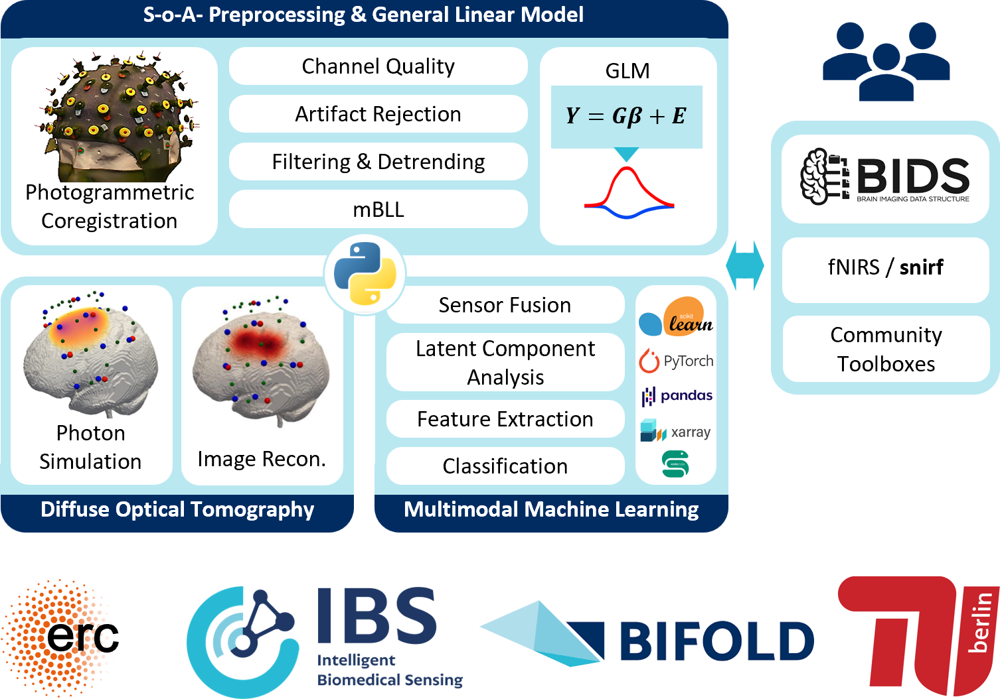

# Cedalion

A python-based framework for the data driven analysis of multimodal fNIRS and DOT in naturalistic environments. Developed by the Intelligent Biomedical Sensing (IBS) Lab with and for the community.



You can find the [github repository for the cedalion toolbox here](https://github.com/ibs-lab/cedalion).

```{toctree}
:maxdepth: 1
:caption: General Info

rationale.md
getting_started/index.md
data_structures/index.md

community/index.md
../LICENSE.md
```

```{toctree}
:maxdepth: 1
:caption: Package Features

data_io/index
sigproc/index
machine_learning/index
image_reco/index
physio/index
plot_vis/index
synth/index
```


```{toctree}
:maxdepth: 1
:caption: Reference

API reference <api/modules.rst>
Bibliography <references.rst>
All examples <examples>
```

```{toctree}
:maxdepth: 1
:caption: Project

Source code <https://github.com/ibs-lab/cedalion>
Issues <https://github.com/ibs-lab/cedalion/issues>
Documentation <https://doc.ibs.tu-berlin.de/cedalion/doc/dev/>
Changelog <CHANGELOG.md>
```

## Special Thanks
We cordially thank our friends and long-term collaborators at the BOAS Lab for their contributions and support in starting this project.


## Version
This documentation was built from commit {{commit_hash}}.
